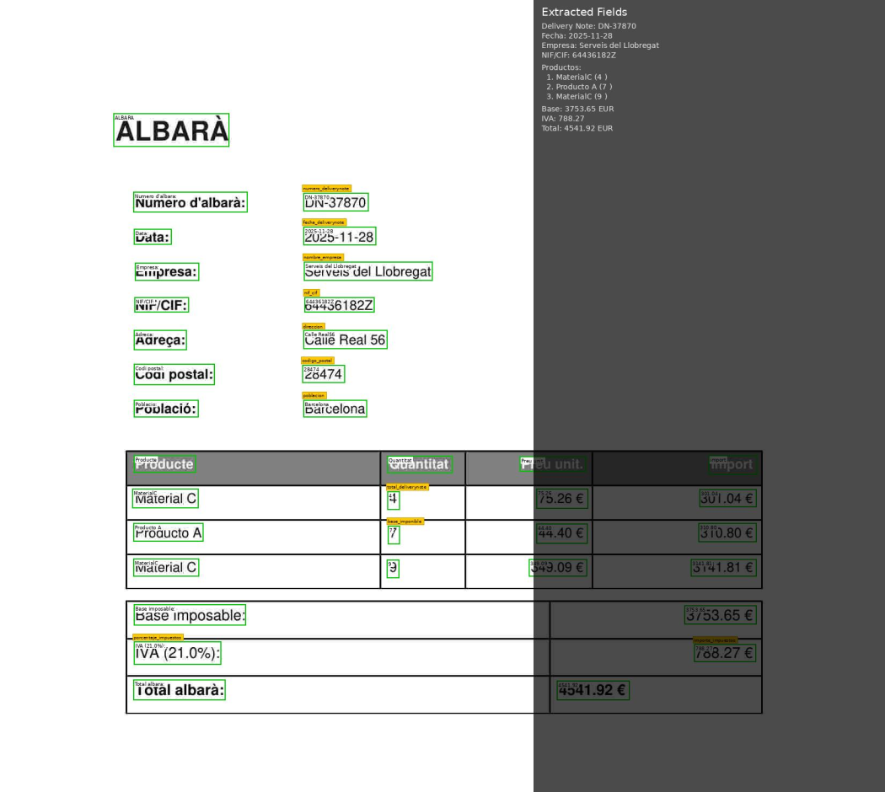
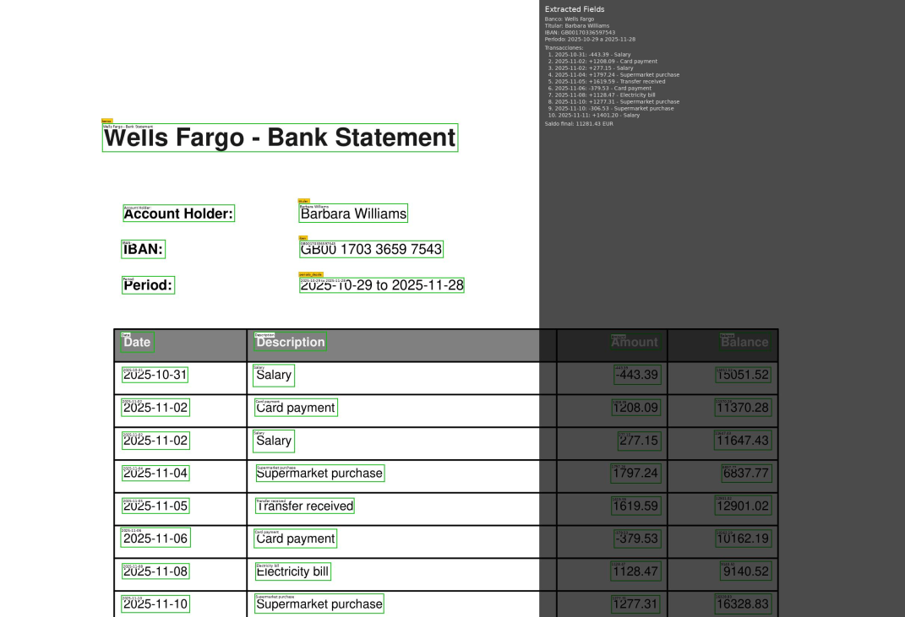
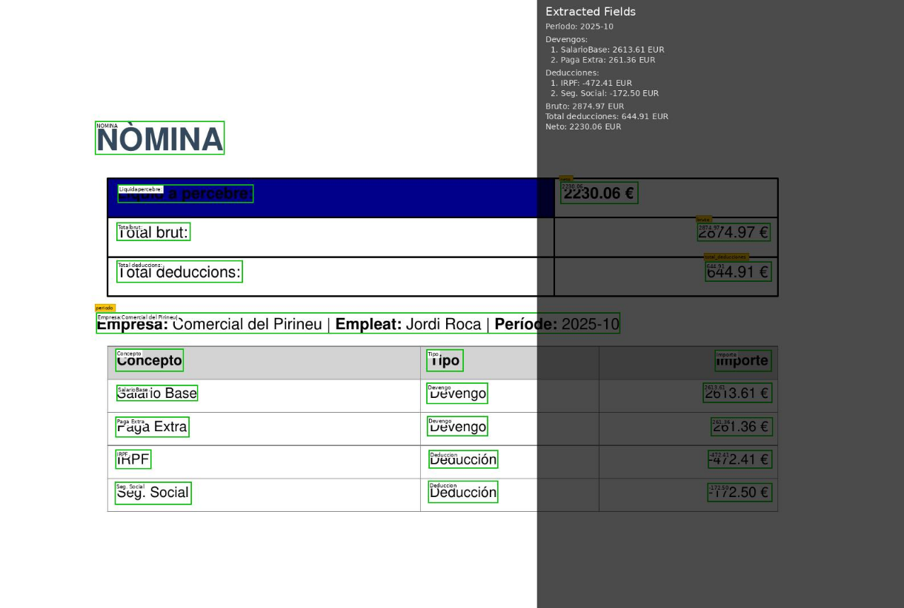
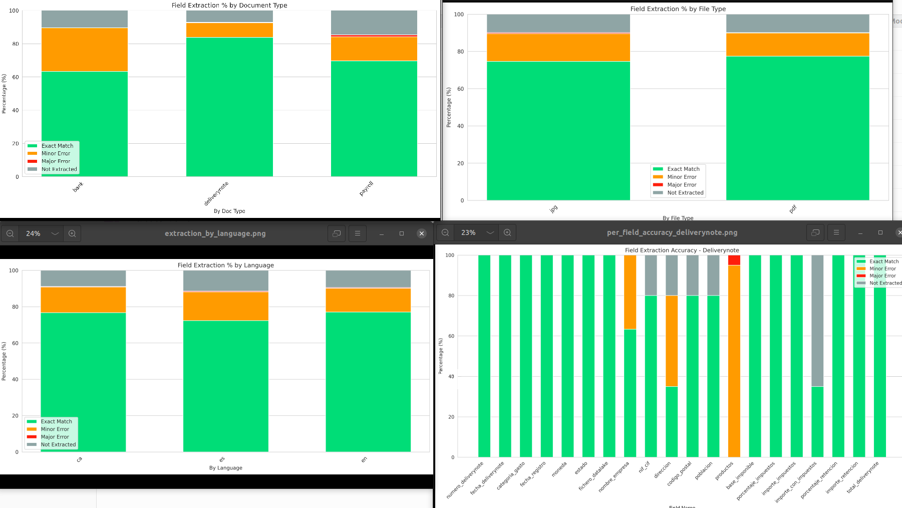

# document-ocr-llm-extractor

A comprehensive end-to-end document processing pipeline that combines OCR (Optical Character Recognition) with Large Language Model (LLM) extraction to automatically extract structured data from various document types. The system supports multiple OCR engines (RapidOCR and Tesseract), processes PDFs and images, and provides rich visualizations with OCR bounding boxes and extracted fields overlaid on the original documents.

**Key Features:**
- 🔍 **Multi-Engine OCR**: Support for RapidOCR and Tesseract with configurable language settings
- 🤖 **LLM-Powered Extraction**: Uses OpenAI-compatible APIs for intelligent field extraction
- 📄 **Multiple Document Types**: Handles delivery notes, bank statements, and payroll documents
- 📊 **Batch Processing & Evaluation**: Tools for processing large datasets and evaluating accuracy
- 📈 **Statistical Analysis**: Comprehensive metrics, visualizations, and model comparison tools
- 🎨 **Rich Visualizations**: Annotated PDFs and images showing OCR results and extracted fields

<div align="center">
  
  
  
</div>

## Installation

**Preferred method (using uv):**

```bash
uv sync
```

**Alternative method (using venv + pip):**

```bash
python -m venv .venv
source .venv/bin/activate  # or .venv\Scripts\activate on Windows
pip install -e .
```

Set your OpenAI-compatible endpoint:

```bash
export OPENAI_API_KEY="sk-..."
export OPENAI_MODEL="gpt-4o-mini"  # optional, default: gpt-4o-mini
# optional custom endpoint:
# export OPENAI_BASE_URL="https://your-endpoint/v1"
```

## Generate Synthetic Datasets

Generate test datasets (Catalan, Spanish, English):

```bash
uv run python tools/generate_dataset.py
```

Creates PDFs and JPG images (quality variants: q90, q40, q10) organized by type (`deliverynote`, `bank`, `payroll`) and language.

## Usage

### Basic Usage

```bash
# Process a PDF (default: deliverynote, RapidOCR)
document-llm-extractor path/to/document.pdf --output-dir outputs --pretty

# Specify document type
document-llm-extractor path/to/document.pdf --doc-type bank --output-dir outputs

# Process an image
document-llm-extractor path/to/document.jpg --output-dir outputs
```

### Document Types

- `deliverynote` - Delivery notes (default)
- `bank` - Bank statements
- `payroll` - Payroll/payslip documents

### CLI Options

- `--doc-type` - Document type (default: `deliverynote`)
- `--output-dir` - Output directory (default: `outputs`)
- `--pretty` - Pretty-print JSON
- `--redact` - Redact sensitive info in visualization
- `--ocr-engine` - OCR engine: `rapidocr` (default) or `tesseract`
- `--langs` - OCR languages (default: `"spa,cat,eng"`)
- `--tesseract-oem` - Tesseract engine mode (0-3, default: 1)
- `--tesseract-psm` - Tesseract page segmentation (0-13, default: 6)

See [docs/USAGE.md](docs/USAGE.md), [docs/OCR_ENGINES.md](docs/OCR_ENGINES.md), [docs/ARCHITECTURE.md](docs/ARCHITECTURE.md) for details.

## Batch Processing & Evaluation

The project includes tools for batch processing, evaluation, and statistical analysis:

### Batch Inference

Process multiple documents at once:

```bash
# Process all documents (or limit with --limit)
uv run python tools/batch_inference.py --ocr-engine rapidocr --doc-type deliverynote --limit 10

# Process specific document types
uv run python tools/batch_inference.py --ocr-engine tesseract --doc-type bank --langs "spa,eng"
```

**Options:**
- `--data-dir` - Directory containing documents (default: `data`)
- `--output-dir` - Output directory (default: `outputs`)
- `--limit` - Maximum number of documents to process
- `--doc-type` - Filter by document type: `deliverynote`, `bank`, `payroll`
- `--ocr-engine` - OCR engine: `rapidocr` (default) or `tesseract`
- `--langs` - OCR languages (default: `"spa,cat,eng"`)

### Evaluation

Compare extracted results against ground truth:

```bash
uv run python tools/evaluate_results.py --ocr-engine rapidocr
```

Evaluates field-level accuracy, OCR quality (CER/WER), and classifies errors. Results are saved to `outputs/{ocr-engine}/evaluations/`.

### Statistics & Visualization

Generate aggregated statistics and plots:

```bash
uv run python tools/generate_statistics.py --ocr-engine rapidocr
```

Generates:
- Field-level accuracy metrics (precision, recall, F1)
- OCR quality histograms (CER/WER)
- Error analysis (Pareto charts)
- Heatmaps by document type and language
- Per-field accuracy plots with confidence intervals

Results are saved to `outputs/{ocr-engine}/statistics/` with JSON stats and PNG plots.

**Sample Evaluation Results:**

<div align="center">
  
</div>

### Model Comparison

Compare two model variants using statistical tests:

```bash
uv run python tools/compare_models.py \
  --eval-dir-A outputs/rapidocr/evaluations/deliverynote/es \
  --eval-dir-B outputs/tesseract/evaluations/deliverynote/es \
  --field "numero_deliverynote"
```

Uses McNemar's test for paired comparisons to determine if differences are statistically significant.

### Complete Workflow

```bash
# 1. Generate synthetic datasets
uv run python tools/generate_dataset.py

# 2. Run batch inference
uv run python tools/batch_inference.py --ocr-engine rapidocr --doc-type deliverynote

# 3. Evaluate results
uv run python tools/evaluate_results.py --ocr-engine rapidocr

# 4. Generate statistics and plots
uv run python tools/generate_statistics.py --ocr-engine rapidocr

# 5. Compare models (optional)
uv run python tools/compare_models.py \
  --eval-dir-A outputs/rapidocr/evaluations/deliverynote/es \
  --eval-dir-B outputs/tesseract/evaluations/deliverynote/es \
  --field "numero_deliverynote"
```

See [docs/USAGE.md](docs/USAGE.md) and [docs/STATISTICS_GRAPHS.md](docs/STATISTICS_GRAPHS.md) for detailed information.

## Configuration

All settings can be configured via environment variables with the `DOCUMENT_LLM_` prefix.
See `.env.template` for all available settings.

## Notes

* Uses OpenAI structured outputs with JSON schema validation (strict mode, falls back to json_object).
* Pydantic validation for type safety.
* Configuration-driven architecture supports multiple document types.
* Visualization includes OCR bounding boxes and extracted fields.
